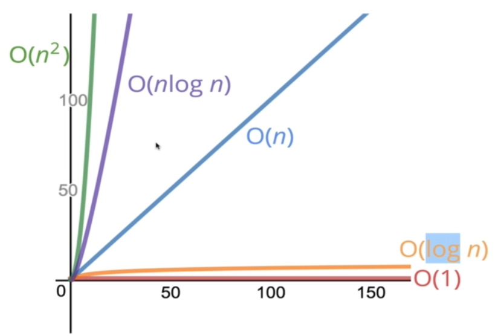

# Big O Notation

Big O notation is one of the most fundamental tools for computer scientists to analyze the cost of an `algorithm`.

Big O notation describes the `complexity` of your code using algebraic terms.

 

**`Complexity`**

| Big-O-Nogation | Name        |
| -------------- | :---------- |
| O(1)           | Constant    |
| O(Log N)       | Logrithmic  |
| O(N)           | Linear      |
| O(N Log N)     | N x Log N   |
| O(N2)          | Quadratic   |
| O(N3)          | Qubic       |
| O(2N)          | Exponential |
| O(N!)          | Factorial   |

 

**`What does better mean?`**

- Faster?.
- Less memory-intensive?.
- More readable?.

### Big O shorthands

- Arithmetic operations are constant.
- Variable assignment is constant.
- Accessing element in an array (by index) or Object (by key) is constant.
- In a loop, the complexity is the length of the loop times the complexity of whatever happens inside of the loop.

