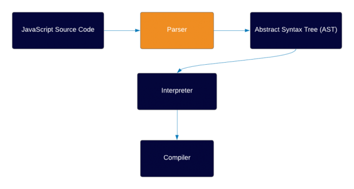

<!-- https://hacks.mozilla.org/2017/02/a-crash-course-in-just-in-time-jit-compilers/  -->
<!-- https://hacks.mozilla.org/2018/03/es-modules-a-cartoon-deep-dive/ -->
<!-- https://hacks.mozilla.org/2017/06/a-crash-course-in-memory-management/ -->
<!-- 1. https://medium.com/devschacht/a-crash-course-in-memory-management-b4863e000a5f -->
<!-- 2. https://hacks.mozilla.org/2017/06/a-cartoon-intro-to-arraybuffers-and-sharedarraybuffers/ -->
<!-- 3. https://hacks.mozilla.org/2017/06/avoiding-race-conditions-in-sharedarraybuffers-with-atomics/ -->
<!-- https://hacks.mozilla.org/2021/06/implementing-private-fields-for-javascript/ -->
<!-- https://hacks.mozilla.org/2015/07/es6-in-depth-let-and-const/ -->

# Js Engine

A JavaScript engine is a software component that executes JavaScript code.

The first JavaScript engines were mere interpreters, but all relevant modern engines use just-in-time compilation for improved performance.

A JavaScript engine is a computer program that executes JavaScript code and converts it into computer understandable language (Machine Language).

# Popular javascript engines

1. Chrome v8 engine
2. SpiderMonkey (firebox)
3. JavascriptCore (safari)
4. Chakra (Edge)

# History of javascript engine

\- Javascript was mostly an interpreted language!

\- Every single line is interepreted and executed on ater the other

# V8

\- V8 is Google’s open source high-performance JavaScript and WebAssembly engine, written in C++.
\- It is used in Chrome and in Node.js.
\- V8 compiles and executes JavaScript source code, handles memory allocation for objects, and garbage collects objects it no longer needs.

## Parser

